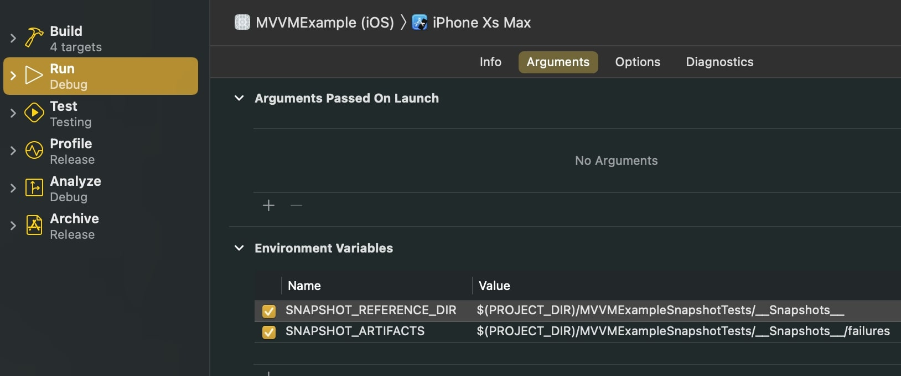
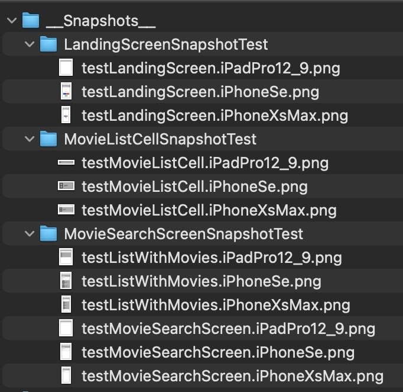
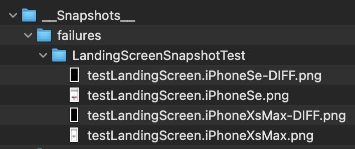
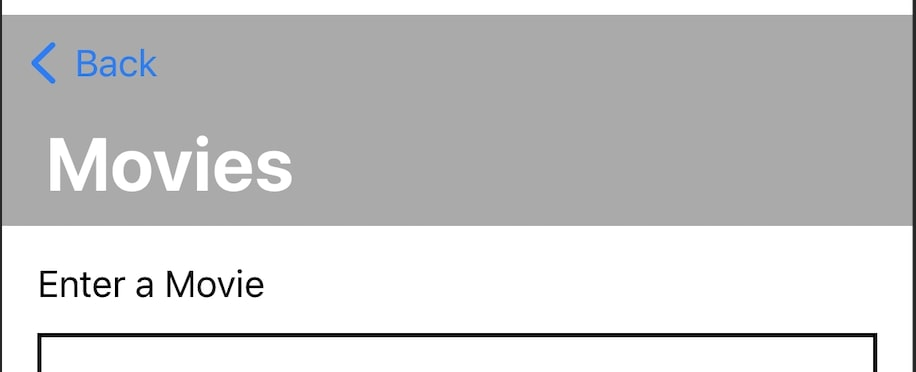

# Snapshot Testing
## Dependencies
> NOTE: these dependencies are also available via Carthage and Swift Package Manager

### In Snapshot Test target (Using CocoaPods)
* pod 'SnapshotTesting' [link](https://cocoapods.org/pods/SnapshotTesting)

## Snapshot Testing Setup
> NOTE: This implementation uses the SnapshotTesting dependency PLUS a custom implementation using a BaseSnapshotTest class. [What this does](README.md#snapshot-flow-basesnapshottest---what-this-does) is explained below.
* Create a new Snapshot Test Target (Unit Test Bundle)
* > NOTE: All files created from this point on (unless specified) will be inside the Snapshot Test Target.
* Add pod (SnapshotTesting) [Podfile Example](/Podfile)
* Add Scheme Environment Variables for the Snapshot Test files
  * Go to your Scheme > Run > Arguments
  * Under Environment Variables add:
    * SNAPSHOT_REFERENCE_DIR (with a value of) $(PROJECT_DIR)/{Your SnapshotTest target}/__Snapshots__
    * SNAPSHOT_ARTIFACTS (with a value of) $(PROJECT_DIR)/{Your SnapshotTest target}/__Snapshots__/failures
    * 
  * > NOTE: you do not need to have the Snapshots placed inside the Snapshot Test folder if you do not want. It can be placed top level, or wherever you want. Just make sure that the path to the `__Snapshots__` dir is the same between the two environmental vars.
* Copy all files from the Base folder [link](MVVMExampleSnapshotTests/Base)
  * [BaseSnapshotTest](MVVMExampleSnapshotTests/Base/BaseSnapshotTest.swift)
  * [Strings+extensions](MVVMExampleSnapshotTests/Base/Strings%2Bextensions.swift)
* In your `.gitIgnore` add `__Snapshots__/failures` (this prevents accidental upload of failure files)
* In BaseSnapshotTest enter into `devicesToTest` var the devices you want to snapshot. 
* Create a .swift test file that subclasses `BaseSnapshotTest`
* Create your test method
  * Instantiate the view you want to test using `UIHostingController`
    * `let uut = UIHostingController<MyCustomView>(rootView:MyCustomView())`
  * Call `takeSnapshot(for: uut)`

## Snapshot Flow: BaseSnapshotTest - what this does
> BaseSnapshotTest TL;DR: SnapshotTesting puts all baseline snapshots into the folder of the Test file that ran it (as well as the failures). This is a bit unorganized. BaseSnapshotTest aggregates everything into ONE folder (dictated by the `SNAPSHOT_REFERENCE_DIR` environmental var set earlier. It ALSO generates the DIFF between the baseline image and the faliure image and gives you access to it. SnapshotTesting generates these, but places them in inconvenient locations. BaseSnapshotTest gathers everything together for simple usage.
* Test is Run
* BaseSnapshotTest > `setUp()`
  * This goes through and deletes the failure and diff files for that specific snapshot. This is so that if the issue was solved and the snapshot matches the baseline there isn't an extra file sitting around.
* Test calls `takeSnapshot(for:)` (a custom implementation of SnapshotTesting > `verifySnapshot()`)
  * Loops through the `devicesToTest` (the array with your specified devices to snapshot)
  * If no baseline snapshot exists, SnapshotTesting will automatically create one (see SnapshotTesting [documentation](https://cocoapods.org/pods/SnapshotTesting#usage))
  * Baseline snapshots are placed into a folder using the `SNAPSHOT_REFERENCE_DIR` var set up above, named `__Snapshots__`.
    * Each test file is created as a folder, with each individual test given an image with this naming convention
      * {methodName}.{deviceName}.png
      * 
* If there IS a FAILURE...
  * BaseSnapshotTest > `record(_ issue:)` (this is an overriden XCTestCase method called when XCTestCase fails) calls `saveDiffImage()`
    * Failure snapshots are placed into a folder using the 'SNAPSHOT_ARTIFACTS' var set up above
    * Similar to the Baseline snapshots, each test file is created as a folder, with each individual failure given an image with this naming convention
      * {methodName}.{deviceName}.png
    * Along with a DIFF file, showing the difference between the baseline image and the failure image, with this naming convention
      * {methodName}.{deviceName}-DIFF.png
      * 
* If there is NOT a FAILURE
  * BaseSnapshotTest has cleaned out all the failure files and folders leaving a clean Snapshot folder with only baseline images that can be committed.

## Snapshot quality of life additions
* BaseSnapshotTest > `takeSnapshot(for:)` has a few arguments that can be overriden. Two have been added that go beyond the SnapshotTesting `verifySnapshot` method
  * `addToNavigationView`: Adds your testing view to a UINavigationController as the SECOND viewcontroller. This allows you to see:
    * `.navigationTitle()` attribute set on the view
    * Back button placement
    * Any `UINavigationBar.appearance()` settings (see [MVVMExampleApp](Shared/MVVMExampleApp.swift))
    * Example taken from [MovieSearchScreenSnapshotTest](MVVMExampleSnapshotTests/__Snapshots__/MovieSearchScreenSnapshotTest/testListWithMovies.iPhoneSe.png)
    * 
  * `clipToComponent`: Reduces the size of the snapshot to fit the actual component
    * Reduces the overal filesize and contains the component to its size as it is loaded in the dictated screen size
    * Example taken from [MovieListCellSnapshotTest](MVVMExampleSnapshotTests/__Snapshots__/MovieListCellSnapshotTest/testMovieListCell.iPhoneSe.png)
    * 

## Snapshot: Injecting Mock Data
* Provided that your Views are set up for dependency injection, it is rather simple.
* See [MovieSearchScreenSnapshotTest](MVVMExampleSnapshotTests/Views/Screens/MovieSearchScreenSnapshotTest.swift)
```
func testListWithMovies() {
    let movieListScreenViewModel = MovieListScreenViewModel()
    movieListScreenViewModel.movies = [
        MovieViewModel(movie: MockMovie.create(withPlacement: "1")),
        MovieViewModel(movie: MockMovie.create(withPlacement: "2")),
        MovieViewModel(movie: MockMovie.create(withPlacement: "3"))
    ]
    let uut = UIHostingController<MovieSearchScreen>(rootView: MovieSearchScreen(withMovieListScreenViewModel: movieListScreenViewModel))

    takeSnapshot(for: uut, addToNavigationView: true)
}  
  
```

## Known Limitations/Issues
* Landscape snapshots are unreliable. SnapshotTesting Dependency is aware of it and this will more than likely improve with future releases.
