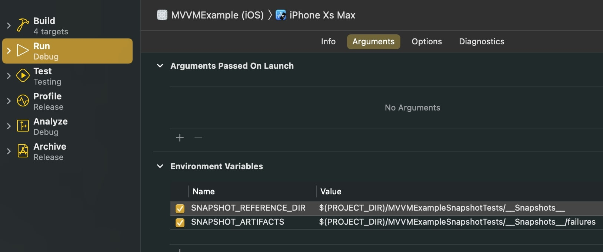

# MVVMExample
## PURPOSE
* An example SwiftUI project to demo MVVM, Unit Testing, and Snapshot Testing.
* Demonstrate that SwiftUI views can be tested using Quick / Nimble
* A resource to pull Base files and extensions for future projects.

## Dependencies
> NOTE: these dependencies are also available via Carthage and Swift Package Manager

### In UnitTest target (Using CocoaPods) 
* pod 'Quick' [link](https://cocoapods.org/pods/Quick)
* pod 'Nimble' (Quick and Nimble are used for writing easily readable tests very fast) [link](https://cocoapods.org/pods/Nimble)
* pod 'ViewInspector' (allows UnitTests to inspect and test attributes and methods on SwiftUI views and their children) [link](https://cocoapods.org/pods/ViewInspector)

### In Snapshot Test target (Using CocoaPods)
* pod 'SnapshotTesting' [link](https://cocoapods.org/pods/SnapshotTesting)

## Unit Testing Setup
* Create a new Unit Test Target (Unit Test Bundle) in project (NOTE: The default one that starts with a new project is a UI Test Target).
* > NOTE: All files created from this point on (unless specified) will be inside the Unit Test Target.
* Add pods (Quick, Nimble, ViewInspector). [Podfile Example](/Podfile)
* Create an extension file to extend your SwiftUI Views as Inspectable [EXAMPLE](/MVVMExampleTests/ViewInspector/InspectableView%2BExtensions.swift)
  * Why?... This allows you to inject a mock data into @State, @Binding, etc. If you don't have any need to alter these @ vars (as seen in the [LandingScreen](/Shared/Views/Screens/LandingScreen.swift)) then don't add it. But a view that needs to alter @ vars to test (like the [MovieSearchScreen](/Shared/Views/Screens/MovieSearchScreen.swift))requires it.
  * Also why... It allows you to make custom Views and place them inside other views and inspect them. (see the usage of the custom view MovieListView in [MovieSearchScreen](/Shared/Views/Screens/MovieSearchScreen.swift))
* You may want to copy / use the extension file created in this project to make fetching view attributes easier [EXAMPLE](/MVVMExampleTests/ViewInspector/Inspection%2BExtensions.swift)

## Unit Testing Usage (basic)
* ViewInspector has a few different ways to get view children.
* This example adds a ```.id()``` to each element in the view hierarchy to make it more clear. However, this is not necessary.
* When creating a variable for an element it must be type cast as an `InspectableView` with a type of `KnownViewType.Type`.
  * EXAMPLE: 
  * 
  * If you were getting a `Text` SwiftUI view (with an `.id("myText")`you would create the variable as `var someText: InspectableView<ViewType.Text>?`.
  * You would instantiate the test variable as `someText = try uut?.body.inspect().find(ViewType.Text.self, relation: .child, where: { try $0.id() as! String == "myText"})`
  * -OR- (using the mentioned extension file above) you would call `someText = uut?.findChild(type: ViewType.Text.self, withId: "myText")`
* Using ViewInspector you can test interactions (such as `.tap()`) as well as inspect various attributes (such as `.attributes().foregroundColor()`)

## Unit Testing Usage (Making it Inspectable)
If you ever see the error 
> Type '*** View Name ***' does not conform to protocol 'Inspectable'
* Add the View as an extension using Inspectable Protocol `extension MovieListView: Inspectable { }`

As mentioned in the setup above, to alter @State or @Binding vars in a View you have to make it conform to the ViewInspector's `Inspectable` Protocol.
Process:
* In the View add a var at the top of `internal var didAppear: ((Self) -> Void)?` [see MovieSearchScreen](/Shared/Views/Screens/MovieSearchScreen.swift)
  * When testing @State, @Binding, etc ViewInspector uses the didAppear() method to gain access to values.
* In the Test (Spec) file instantiate the view your are testing (uut) like
```
var uut: MyCustomView? 
var myCustomViewModel: MockMyCustomViewModel?

beforeEach {
    var myCustomView = MyCustomView()
    let _ = myCustomView.on(\.didAppear) { view in
        uut = try? view.actualView()
        myCustomViewModel = MockMyCustomViewModel()
        uut?.myCustomViewModel = myCustomViewModel!
    }

    ViewHosting.host(view: myCustomView)
}

```
* Now you will be able to inject into the `@State` vars
  * ViewInspector uses the ViewHosting method (in combination with `.didAppear`) to access @State, @Binding, etc in the `actualView()`. This allows testing of changes to @State vars.
  * Initializing the View using ViewHosting is not needed unless it has @State vars.

### ViewInspector Considerations
* Not ALL SwiftUI APIs are fully covered (...yet)
* A list of covered and under development APIs / attributes is at ViewInspector's github repo [View Inspector readiness list](https://github.com/nalexn/ViewInspector/blob/master/readiness.md)
* However, this is not a major factor since its in active development / improvement, and anything that can't currently be tested could be tested via Snapshot Testing (below)

## Snapshot Testing Setup
> NOTE: This implementation uses the SnapshotTesting dependency PLUS a custom implementation using a BaseSnapshotTest class. [What this does](README.md#snapshot-flow-basesnapshottest---what-this-does) is explained below.
* Create a new Snapshot Test Target (Unit Test Bundle)
* > NOTE: All files created from this point on (unless specified) will be inside the Snapshot Test Target.
* Add pod (SnapshotTesting) [Podfile Example](/Podfile)
* Add Scheme Environment Variables for the Snapshot Test files
  * Go to your Scheme > Run > Arguments
  * Under Environment Variables add:
    * SNAPSHOT_REFERENCE_DIR (with a value of) $(PROJECT_DIR)/{Your SnapshotTest target}/__Snapshots__
    * SNAPSHOT_ARTIFACTS (with a value of) $(PROJECT_DIR)/{Your SnapshotTest target}/__Snapshots__/failures
    * 
* Copy all files from the Base folder [link](/Base)
  * [BaseSnapshotTest](/Base/BaseSnapshotTest.swift)
  * [Strings+extensions](Base/Strings%2Bextensions.swift)
* in your `.gitIgnore` add __Snapshots__/failures (this prevents accidental upload of failure files)
* In BaseSnapshotTest enter into `devicesToTest` var the devices you want to snapshot. 
* Create a .swift test file that subclasses `BaseSnapshotTest`
* create your test method
  * instantiate the view you want to test using `UIHostingController`
    * `let uut = UIHostingController<MyCustomView>(rootView:MyCustomView())`
  * call `takeSnapshot(for: uut)`

## Snapshot Flow: BaseSnapshotTest - what this does
* Test is Run
* BaseSnapshotTest > setUp()
  * This goes through and deletes the files for that specific snapshot. This is so that if the issue was solved and the snapshot matches the baseline there isn't an extra file sitting around.
* Test calls `takeSnapshot(for:)` (a custom implementation of SnapshotTesting > `verifySnapshot()`)
  * Loops through the `devicesToTest` (the array with your specified devices to snapshot)
  * If no baseline snapshot exists, SnapshotTesting will automatically create one (see SnapshotTesting [documentation](https://cocoapods.org/pods/SnapshotTesting#usage))
  * Baseline snapshots are placed into the `SNAPSHOT_REFERENCE_DIR` var set up above, into a folder named `__Snapshots__`.
    * Each test file is created as a folder, with each individual test given an image with this naming convention
      * {methodName}.{deviceName}.png
  *   


### argument overrides TODO`

GitIgnore
* add __Snapshots__/failures

Known Limitations/Issues
* Landscape snapshots are unreliable. swift-snapshot-testing Dependency is aware of it and this will more than likely improve with future releases.
